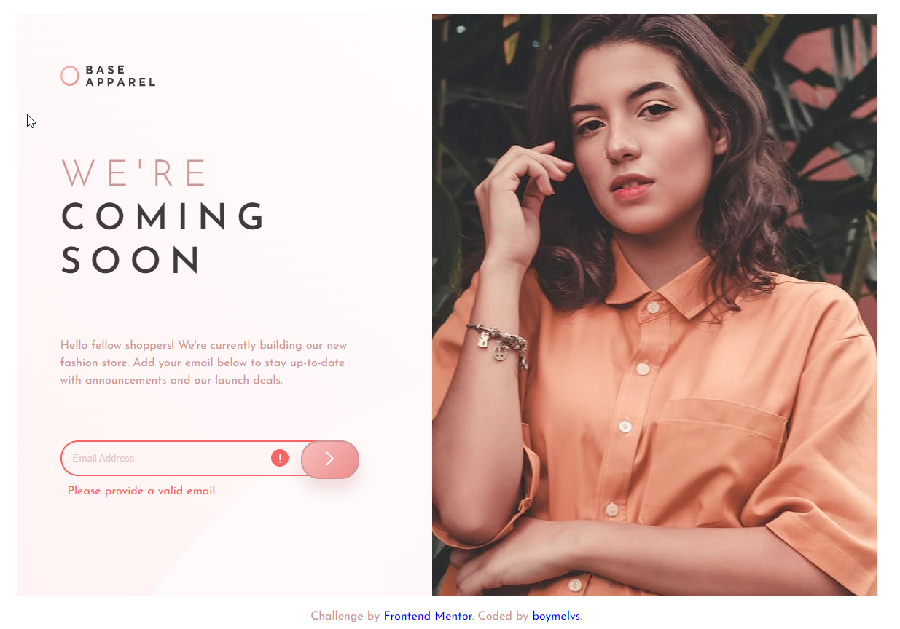

# Frontend Mentor - BASE APPAREL COMING SOON PAGE SOLUTION

## Table of contents

-  [Overview](#overview)
   -  [The challenge](#the-challenge)
   -  [Screenshot](#screenshot)
   -  [Links](#links)
   -  [Built with](#built-with)
-  [Author](#author)

## Welcome! 👋

Thanks for checking out this front-end coding challenge.

## Overview

This is a solution to the [Base Apparel coming soon page challenge on Frontend Mentor](https://www.frontendmentor.io/challenges/base-apparel-coming-soon-page-5d46b47f8db8a7063f9331a0).

### The challenge

Users should be able to:

-  View the optimal layout for the site depending on their device's screen size
-  See hover states for all interactive elements on the page
-  Receive an error message when the `form` is submitted if:
   -  The `input` field is empty
   -  The email address is not formatted correctly

### Screenshot

### Links

-  Live Site URL: [Live site](https://boymelvs.github.io/BASE-APPAREL-COMING-SOON/)

### Built with

-  HTML
-  Flexbox
-  CSS
-  Javascript

## Author

-  Frontend Mentor - [Melvin](https://www.frontendmentor.io/profile/boymelvs)
